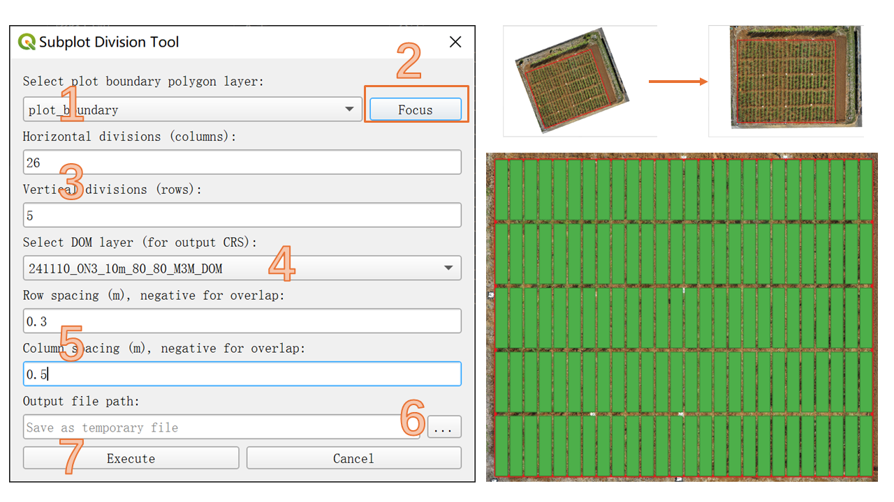

# FIELDimagePy-QGIS
A reimplementation QGIS plugin alternative for FIELDImageR-QGIS, using [QGIS](https://qgis.org/en/site/) build-in python and no need to install R dependencies.

The original FIELDimageR is made by [Popat Pawar](https://www.linkedin.com/in/dr-popat-pawar-204bb136/) and [Filipe Matias](https://www.linkedin.com/in/filipe-matias-27bab5199/) in R, to analyze orthomosaic images from research fields.

## How to execute in QGIS

**Steps 1-2*: activating polygon editing tools.

**Steps 3-6**: choose python script files to run.

## fieldShape

**Step 1**: Choose the plot boundary file (recommended rectange boundary)

If not rectange boundary, the tool will calculate the minimum area bounding rectange as final boundary.

**Step 2**: Click focus, to ensure the correct definition of rows and columns.

**Step 3**: Choose how many subplots to create.

**Step 4**: Select the reference maps.

**Step 5**: Decide the row and column spacing in meters.

**Step 6**: Choose the file name to save the created subplots boundary.

**Step 7**: Execute.

Todo:

* [ ] preview by matplotlib?
* [ ] support input plot size
* [ ] support using excel as plot id
* [ ] translations